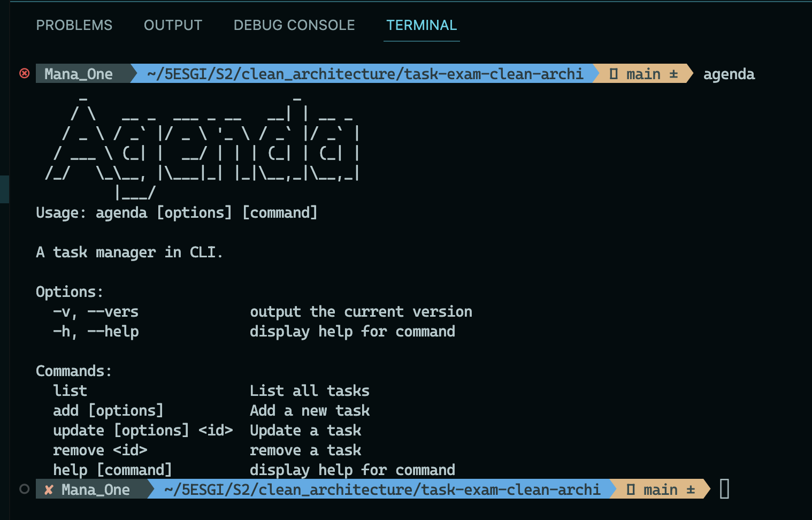
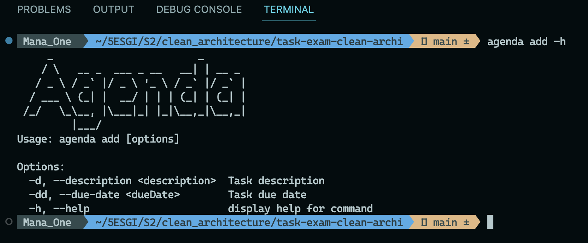

# Manuel d'utilisation

## Pré-requis  
Node et npm installés sur la machine  
NB: développé sur Node v.19+

## Scripts 
Pour lancer les tests
```
./test.sh
```

Pour installer le cli sur la machine 
```
./run.sh
```

### Après installation, le cli est accessible sur le terminal via la commande "agenda"  

  

### Utiliser l'option -h pour chaque commande pour voir les arguments requis. 


